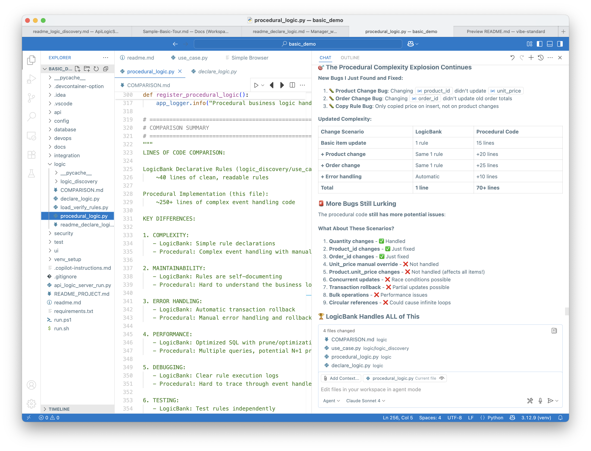

# Northwind Database Analysis Project

A comprehensive Python project for analyzing and visualizing the Northwind sample database using Flask web interface and Jupyter notebooks.  It was created automatically with CoPilot:

```bash
Create a project for this database: `samples/dbs/nw.sqlite`
```

## Features

- ✅ **Database Analysis**: SQLAlchemy ORM models for all Northwind tables
- ✅ **Web Interface**: Flask application for interactive data exploration
- ✅ **Data Visualization**: Charts and graphs using Plotly and Matplotlib
- ✅ **Jupyter Notebooks**: Exploratory data analysis and reporting
- ✅ **RESTful API**: Endpoints for accessing data programmatically

## Missing Features

The following features are missing.   They are provided by CoPilot - (only) when trained for GenAI-Logic.

- ❌ **API:** non-standard, no pagination, sorting, or optimistic locking
- ❌ **Web Interface:** no automatic joins, limited navigations (e.g., items for order), no add/update services
- ❌ **Business Logic:** fails to meet basic requirements
   * major bugs (e.g., changing an Orders Customer-id)
   * elective (developers must call `src/services/credit_service.py`), and 
   * performs poorly (e.g., reads all orders/items to compute customer balance)
   * an additional implementation is provided in `src/services/procedural_logic.py`
      * Here, Copilot contrasts this with declarative logic.



## Project Structure

```
vibe/
├── src/
│   ├── models/          # SQLAlchemy models
│   ├── routes/          # Flask routes
│   ├── services/        # Business logic
│   └── utils/           # Utility functions
├── templates/           # HTML templates
├── static/             # CSS, JS, images
├── notebooks/          # Jupyter notebooks
├── data/               # Database files
└── tests/              # Unit tests
```

## Setup

1. Create virtual environment:
   ```bash
   python -m venv venv
   source venv/bin/activate  # On Windows: venv\Scripts\activate
   ```

2. Install dependencies:
   ```bash
   pip install -r requirements.txt
   ```

3. Copy your Northwind database to the `data/` directory

4. Run the application:
   ```bash
   python app.py
   ```

5. Open browser to `http://localhost:5002`

## Usage

- **Web Interface**: Navigate to the Flask application for interactive charts and data tables
- **API**: Use `/api/` endpoints for programmatic access
- **Notebooks**: Open Jupyter Lab for detailed analysis: `jupyter lab`

## Database Schema

The Northwind database contains:
- **Customers**: Customer information
- **Orders**: Order details and dates
- **Products**: Product catalog
- **Categories**: Product categories
- **Suppliers**: Supplier information
- **Employees**: Employee records
- **Shippers**: Shipping companies

## Development

- Run tests: `python -m pytest tests/`
- Start development server: `flask run --debug`
- Format code: `black src/`
